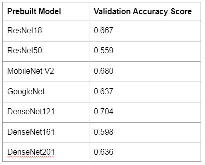
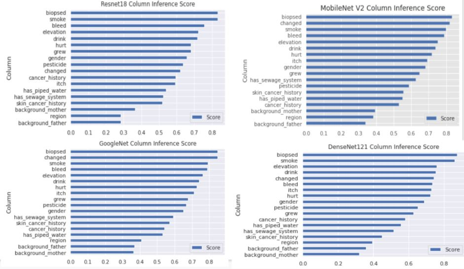
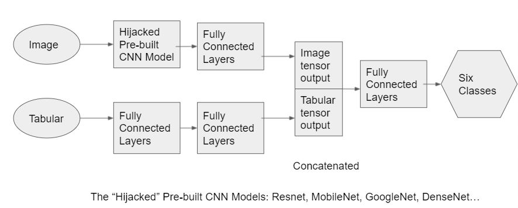
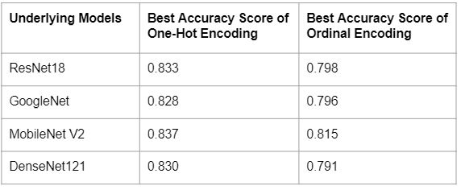
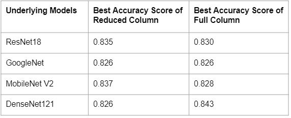
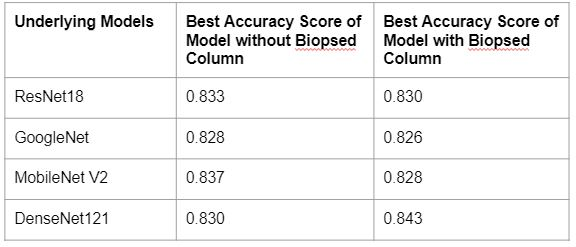
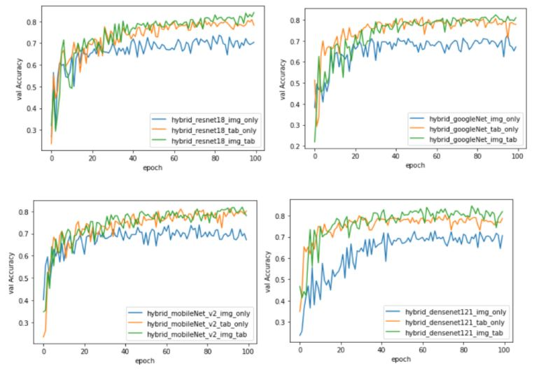
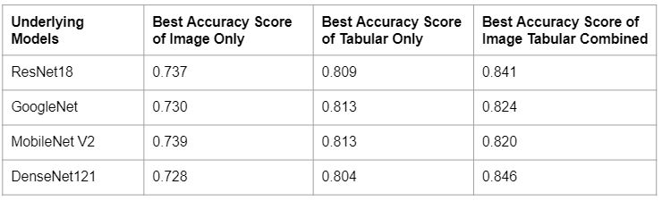
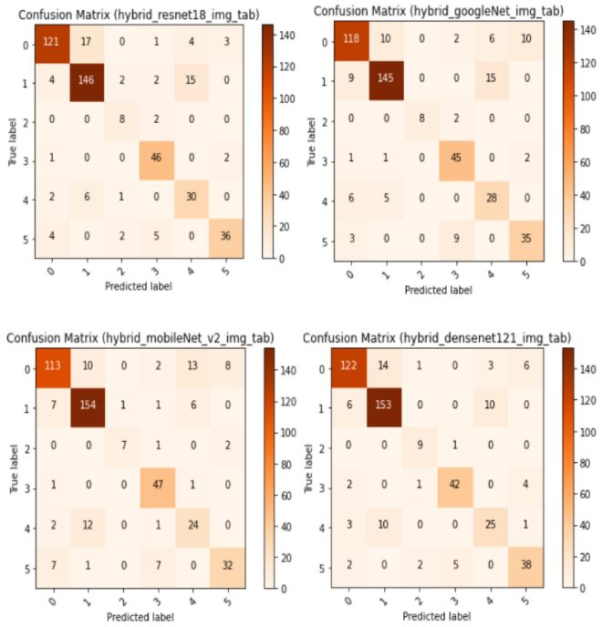

# UMBC Data 606 Project
# Skin Cancer Analysis and Classification by Machine Learning and Deep Learning

## Team Members: 

- Demarcus Wirsing
- Drishti Arora
- Nigist Woldeeyesus
- Sai Kumar Kanuru
- Yunpeng Li

## Project Goals:

- Train various machine learning models on clinic tabular data to predict and evaluate the results of skin lesion classifications.
- Use image processing techniques and construct various deep learning models on skin image data to evaluate the results of skin lesion classifications.
- Use skin cancer image data to inference missing clinic tabular column values through deep learning on image data. 
- Construct a deep leaning hybrid model that combines both image and tabular data to do skin lesion classifications.
- Prove or disapprove combining clinic tabular data and skin lesion image data in deep learning can achieve better accuracy score.
- Evaluate the accuracy and performance of various models in the end and find the best model for skin lesion classifications.

## Project Highlights

### EDA
TODO

### Machine Learning
TODO

### Deep Learning
<ins>Prebuilt CNN Model Experimentation and Selection</ins>

We have utilized Pytorch library API to experiment with several prebuilt CNN models, such as ResNet18, ResNet50, GoogleNet, DenseNet121, DenseNet161, DenseNet201, MobileNet V2, and VGG 16, to train skin lesion image data.

After training the prebuilt CNN models, the validation accuracy scores of four prebuilt CNN models, ResNet18, GoogleNet, DenseNet121, and MobileNet V2, are the top four scores.  After 50 epochs of training, the validation accuracy scores are shown in the following table.  Therefore, the four models become the best four candidates for our further model construction and analysis.
 

<ins>Column Inferencing</ins>

The main purpose of column inference is to use deep learning models trained by image data to predict missing values in columns.  The main strategy is to treat a particular tabular column as a class label, and then train images in deep learning models to predict the value of that column.

Both GoogleNet and DenseNet121 have relatively better overall performance on inferencing column values of our tabular data.  All results show the column biopsy has the highest inferencing scores, so it indicates column biopsy has strong correlation with skin lesion types.  A possible explanation is that a doctor may tend to order a skin biopsy when the patient is suspected to have skin cancer after viewing the patient’s skin image.
 

<ins>Hybrid Model architecture</ins>

In order to train a customized deep learning model with the combined tabular and image data, we have constructed a hybrid model named ImageTabularHybridModel, which extends Pytorch’s nn.Module class.  The hybrid model can be configured and initialized by a user parameter to train image only data, tabular only data, or combined image and tabular data.  Another user parameter specifies what the underlying prebuilt CNN model that the hybrid model should utilize to train image data.  Currently, it supports the four best candidates: ResNet18, GoogleNet, DenseNet121, and MobileNet V2.  When the hybrid model is initialized to train combined image and tabular data, it pushes image data to go through the prebuilt CNN model specified by the user parameter, and the last layer of the original prebuilt CNN model is hijacked and extended to connect 3 fully connected layers with Relu activation.  The tabular data is pushed through another 3 fully connected layers with Relu activation.  Then the output data of the image layer is concatenated with the output data of the tabular layer, and such concatenated data is further pushed through additional 3 fully connected layers with Relu activation.  The last layer outputs 6 nodes that represent 6 types of skin lesions.
 

<ins>One-Hot Encoding vs. Ordinal Encoding</ins>

The following table shows the best accuracy scores of hybrid models after 100 epochs of training on combined image data with One-Hot Encoded tabular data or Ordinal Encoded tabular data.  One-Hot Encoding has significantly better accuracy scores than the accuracy scores of Ordinal Encoding yielded by all the 4 hybrid models.
 
  
<ins>Full Tabular Columns vs. Reduced Tabular Columns</ins>

The following table shows the best accuracy scores of hybrid models after 100 epochs of training on combined image data and tabular data with One-Hot Encoded reduced columns or combined image data and tabular data with One-Hot Encoded full columns.  Reducing tabular columns seems not to have significant performance improvement.  It may make sense because deep learning can figure out what features are important and ignore what are less important after a sufficiently big number of epochs of training.  Or all the original clinic columns may all have some contributions to the classification.
 
  
<ins>With “Biopsed” Column vs. Without “Biopsed” Column</ins>

The following table shows the best accuracy scores of hybrid models after 100 epochs of training on combined image data and tabular data without “biopsy” columns or combined image data and tabular data with “biopsy” column.  Although we suspect the “biopsied” column may introduce bias to skin lesion classifications, the results do not show the missing “biopsied” column has significant influence on our hybrid validation accuracy scores.  A possible explanation is that other clinic tabular columns could make up for the missing influence of “biopsied” column and still contribute significantly to the classifications during deep learning.
 
  
<ins>Image Data Only vs. Tabular Data Only vs. Image Tabular Data Combined</ins>

Regardless of whether including or excluding certain clinic tabular columns, after training the 4 hybrid models, all results consistently show that models trained by image tabular combined data have higher validation accuracy scores than the scores of the  models only trained by tabular data or only trained by image data.  Such finding confirms our hypothesis that combining image data and clinic tabular data in deep learning for skin lesion classification can reach higher accuracy.  The results are illustrated in the following figures.  The green curve represents the validation accuracy score of models trained by image-tabular combined data in 100 epochs of training.  The orange curve represents the validation accuracy score of models trained by tabular only data in 100 epochs of training.  It is slightly slower than the green curve.  The lowest blue curve represents the validation accuracy score of models trained by image only data in 100 epochs of training.
 
  
<ins>Best Hybrid Models</ins>

We have applied upsampling to balance underrepresented skin lesion types in the training dataset and kept recording the best validation accuracy score of each hybrid model in each epoch iteration.  The state and parameters of the best performance model are persisted in a file so that models can be easily loaded instead of being retrieved by retraining.  The highest accuracy score is 0.846 of the hybrid model that utilizes DenseNet121.  The 2nd best score is 0.841 of the hybrid model that utilizes ResNet18.  Both scores are very close to each other, but due to the complexity of model architecture of DenseNet121, DenseNet121 takes longer time and high computing resources to be trained.  When the model state is saved to a file, loading a trained hybrid model utilizing DenseNet121 is not an issue.  The following table shows the best validation accuracy scores for each hybrid model.
 

The following figures illustrate the confusion matrix of each hybrid model.
 
